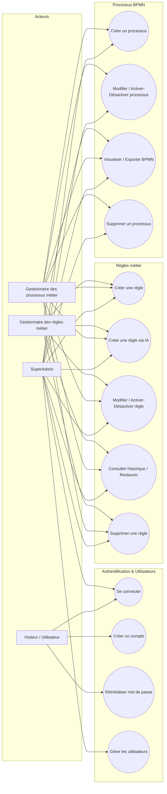

# Cas d'utilisation — Plateforme de gestion du commerce international

Ce document décrit les principaux cas d'utilisation de l'application pour les modules :
- Authentification & Gestion des utilisateurs
- Gestion des processus BPMN
- Gestion des règles métier

## Diagramme des cas d'utilisation

---

## Module 1 — Authentification & Gestion des utilisateurs

### UC1 : Se connecter

| Champ | Détail |
|---|---|
| **Acteur principal** | Utilisateur (tout rôle) |
| **Objectif** | S'authentifier et accéder à l'espace correspondant à son rôle |
| **Précondition** | L'utilisateur possède un compte Keycloak valide |
| **Scénario nominal** | 1. L'utilisateur saisit identifiant + mot de passe 2. Il clique sur « Se connecter » 3. Le système vérifie les identifiants via Keycloak 4. Le système récupère les rôles 5. Redirection : SuperAdmin → Users, Gestionnaire processus → Processus, Gestionnaire règles → Règles, sinon → Dashboard |
| **Scénario alternatif** | A1 : champs vides → « Veuillez entrer vos identifiants » A2 : identifiants incorrects → « Identifiants incorrects » A3 : Keycloak indisponible → « Erreur lors de la connexion » |
| **Post-condition** | Session active créée, utilisateur redirigé vers son espace de travail |

### UC2 : Créer un compte

| Champ | Détail |
|---|---|
| **Acteur principal** | Visiteur (non authentifié) |
| **Objectif** | Créer un compte utilisateur avec un rôle métier |
| **Précondition** | Accès à la page de connexion |
| **Scénario nominal** | 1. Le visiteur ouvre le formulaire d'inscription 2. Il saisit prénom, nom, email, mot de passe, confirmation 3. Il choisit un rôle (SuperAdmin / Gestionnaire processus / Gestionnaire règles) 4. Il valide 5. Le système crée le compte via Keycloak avec ce rôle 6. Message « Compte créé avec succès » |
| **Scénario alternatif** | A1 : champ manquant → « Veuillez remplir tous les champs » A2 : mots de passe différents → « Les mots de passe ne correspondent pas » A3 : erreur serveur (compte déjà existant…) → « Erreur lors de la création du compte » |
| **Post-condition** | Nouveau compte créé dans Keycloak avec le rôle choisi |

### UC3 : Réinitialiser son mot de passe

| Champ | Détail |
|---|---|
| **Acteur principal** | Utilisateur |
| **Objectif** | Recevoir un lien de réinitialisation de mot de passe |
| **Précondition** | L'utilisateur connaît l'email de son compte |
| **Scénario nominal** | 1. Clic sur « Mot de passe oublié » 2. Saisie de l'email 3. Le système transmet la demande à Keycloak 4. Message générique « Si cet email existe, un lien vous a été envoyé » |
| **Scénario alternatif** | A1 : email vide → « Veuillez saisir votre email » A2 : erreur d'envoi → « Erreur lors de l'envoi » |
| **Post-condition** | Email de réinitialisation envoyé si le compte existe |

### UC4 : Gérer les utilisateurs (CRUD, rôles, statut)

| Champ | Détail |
|---|---|
| **Acteur principal** | SuperAdmin |
| **Objectif** | Créer, consulter, modifier, activer/désactiver ou supprimer des comptes et leurs rôles |
| **Précondition** | Connecté avec le rôle SuperAdmin |
| **Scénario nominal** | 1. Accès à « Gestion Users » 2. Le système affiche la liste paginée/filtrable (recherche, statut, rôle) 3. Clic sur « Ajouter un utilisateur » 4. Saisie des infos (nom, email, mot de passe, rôle) 5. Validation → création de l'utilisateur |
| **Scénario alternatif** | A1 (Modifier) : ouverture d'un utilisateur, modification infos/rôles, enregistrement A2 (Activer/Désactiver) : bascule du statut sans suppression A3 (Supprimer) : confirmation puis suppression définitive A4 (Export) : export CSV de la liste A5 : données invalides/erreur serveur → toast d'erreur, opération annulée |
| **Post-condition** | La liste des utilisateurs et la base Keycloak reflètent les changements |

---

## Module 2 — Gestion des processus BPMN

### UC5 : Créer un processus métier

| Champ | Détail |
|---|---|
| **Acteur principal** | Gestionnaire des processus métier (ou SuperAdmin) |
| **Objectif** | Définir un nouveau processus avec ses tâches/étapes |
| **Précondition** | Utilisateur connecté avec un rôle autorisé |
| **Scénario nominal** | 1. Accès à « Gestion Processus » 2. Clic sur « Nouveau processus » 3. Saisie nom, description, configuration des tâches 4. Validation 5. Le système enregistre et affiche le processus dans la liste |
| **Scénario alternatif** | A1 : champs obligatoires manquants → erreur, formulaire non soumis A2 : erreur serveur → processus non créé |
| **Post-condition** | Nouveau processus créé, actif par défaut, visible dans la liste |

### UC6 : Modifier / Activer-Désactiver un processus

| Champ | Détail |
|---|---|
| **Acteur principal** | Gestionnaire des processus métier (ou SuperAdmin) |
| **Objectif** | Mettre à jour un processus existant ou changer son statut |
| **Précondition** | Le processus existe, droits suffisants |
| **Scénario nominal** | 1. Sélection d'un processus dans la liste 2. Ouverture du formulaire de modification 3. Modification des champs (nom, description, tâches, durée…) 4. Enregistrement 5. Mise à jour du processus |
| **Scénario alternatif** | A1 (Activer/Désactiver) : bascule du statut directement depuis la liste A2 : données invalides → erreur, modification annulée |
| **Post-condition** | Le processus est mis à jour (infos et/ou statut) |

### UC7 : Visualiser et exporter le diagramme BPMN

| Champ | Détail |
|---|---|
| **Acteur principal** | Gestionnaire des processus métier / Gestionnaire des règles métier / SuperAdmin |
| **Objectif** | Visualiser le diagramme BPMN d'un processus et l'exporter |
| **Précondition** | Le processus possède des tâches définies |
| **Scénario nominal** | 1. Clic sur « Voir le BPMN » depuis la liste 2. Le système génère et affiche le diagramme (tâches, gateways, règles associées) 3. Navigation/zoom dans le diagramme 4. Clic sur « Exporter » → téléchargement |
| **Scénario alternatif** | A1 : aucune tâche → « Aucune tâche à afficher » A2 : erreur lors de l'export → message d'erreur |
| **Post-condition** | Diagramme affiché et/ou exporté sur le poste utilisateur |

### UC8 : Supprimer un processus

| Champ | Détail |
|---|---|
| **Acteur principal** | Gestionnaire des processus métier / SuperAdmin |
| **Objectif** | Supprimer définitivement un processus obsolète |
| **Précondition** | Le processus existe |
| **Scénario nominal** | 1. Clic sur « Supprimer » 2. Demande de confirmation 3. Confirmation par l'utilisateur 4. Suppression du processus |
| **Scénario alternatif** | A1 : annulation → aucune suppression A2 : processus lié à des règles/tâches actives → avertissement avant suppression |
| **Post-condition** | Le processus disparaît de la liste |

---

## Module 3 — Gestion des règles métier

### UC9 : Créer une règle métier (manuellement)

| Champ | Détail |
|---|---|
| **Acteur principal** | Gestionnaire des règles métier (ou SuperAdmin / Gestionnaire des processus métier) |
| **Objectif** | Définir une règle (conditions + action) rattachée à une catégorie |
| **Précondition** | Connecté avec rôle autorisé, au moins une catégorie existe |
| **Scénario nominal** | 1. Accès à « Règles Métier » 2. Clic sur « Nouvelle règle » 3. Saisie code, nom, catégorie, action, conditions (champ/opérateur/valeur) 4. Activation (ou non) de la règle 5. Validation 6. Le système génère le DRL et enregistre la règle |
| **Scénario alternatif** | A1 : champs/conditions invalides → erreur, règle non créée A2 : code déjà existant → erreur de doublon |
| **Post-condition** | Règle créée, visible dans la liste avec son DRL généré |

### UC10 : Créer une règle métier via l'IA (NLP)

| Champ | Détail |
|---|---|
| **Acteur principal** | Gestionnaire des règles métier (ou SuperAdmin / Gestionnaire des processus métier) |
| **Objectif** | Générer automatiquement une règle (conditions + action + DRL) à partir d'une phrase en langage naturel |
| **Précondition** | Connecté avec rôle autorisé, service IA/NLP disponible |
| **Scénario nominal** | 1. Accès à « Créer avec l'IA » 2. Saisie d'une phrase métier en langage naturel 3. Clic sur « Convertir avec l'IA » 4. Le système propose conditions, action, catégorie, score de confiance, DRL 5. L'utilisateur vérifie/édite les champs 6. Clic sur « Créer la règle » 7. Enregistrement de la règle |
| **Scénario alternatif** | A1 : confiance faible/ambiguïtés → points à clarifier affichés, correction manuelle avant validation A2 : phrase non interprétable/erreur IA → message d'erreur, l'utilisateur recommence ou crée manuellement A3 : champs invalides après édition → bouton « Créer la règle » désactivé |
| **Post-condition** | Nouvelle règle (avec DRL) créée et ajoutée à la liste |

### UC11 : Modifier / Activer-Désactiver une règle métier

| Champ | Détail |
|---|---|
| **Acteur principal** | Gestionnaire des règles métier (ou SuperAdmin / Gestionnaire des processus métier) |
| **Objectif** | Mettre à jour une règle existante ou changer son statut d'activation |
| **Précondition** | La règle existe |
| **Scénario nominal** | 1. Ouverture d'une règle depuis la liste 2. Modification du nom, catégorie, action et/ou conditions 3. Enregistrement 4. Le système met à jour la règle (et son DRL) et archive une version dans l'historique |
| **Scénario alternatif** | A1 (Activer/Désactiver) : bascule du statut directement depuis la liste A2 : données invalides → erreur, modification annulée |
| **Post-condition** | Règle mise à jour, nouvelle version enregistrée dans l'historique |

### UC12 : Consulter l'historique et restaurer une version

| Champ | Détail |
|---|---|
| **Acteur principal** | Gestionnaire des règles métier / SuperAdmin |
| **Objectif** | Visualiser les versions antérieures d'une règle et restaurer l'une d'elles |
| **Précondition** | La règle a déjà été modifiée (historique non vide) |
| **Scénario nominal** | 1. Ouverture du détail d'une règle 2. Sélection de l'onglet « Historique » 3. Le système affiche les versions (date, auteur, modifications) 4. Sélection d'une version + clic « Restaurer » 5. Confirmation et application de la version restaurée |
| **Scénario alternatif** | A1 : aucun historique → « Aucune version antérieure » A2 : annulation de la restauration → aucun changement |
| **Post-condition** | La règle reflète la version restaurée (ou reste inchangée) |

### UC13 : Supprimer une règle métier

| Champ | Détail |
|---|---|
| **Acteur principal** | Gestionnaire des règles métier / SuperAdmin |
| **Objectif** | Supprimer définitivement une règle obsolète |
| **Précondition** | La règle existe |
| **Scénario nominal** | 1. Clic sur « Supprimer » 2. Demande de confirmation 3. Confirmation 4. Suppression de la règle |
| **Scénario alternatif** | A1 : annulation → aucune suppression A2 : règle utilisée dans un ou plusieurs processus → avertissement des impacts avant suppression |
| **Post-condition** | La règle disparaît de la liste et n'est plus appliquée |
